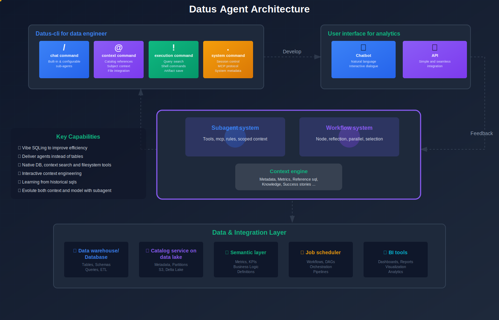

<table width="100%">
  <tr>
    <td align="left">
      <a href="https://www.apache.org/licenses/LICENSE-2.0">
        
      </a>
    </td>
    <td align="right">
      <a href="https://datus.ai"></a> 
    </td>
    <td align="right">
      <a href="https://docs.datus.ai/"></a> 
    </td>
    <td align="right">
      <a href="https://docs.datus.ai/getting_started/Quickstart/"></a> 
    </td>
    <td align="right">
      <a href="https://docs.datus.ai/release_notes/"></a> 
    </td>
    <td align="right">
      <a href="https://join.slack.com/t/datus-ai/shared_invite/zt-3g6h4fsdg-iOl5uNoz6A4GOc4xKKWUYg"></a>
    </td>
  </tr>
</table>

## 🎯 Overview

**Datus** is an open-source data engineering agent that builds evolvable context for your data system. 

Data engineering needs a shift from "building tables and pipelines" to "delivering scoped, domain-aware agents for analysts and business users. 



* Datus-CLI: An AI-powered command-line interface for data engineers—think "Claude Code for data engineers." Write SQL, build subagents, and construct context interactively.
* Datus-Chat: A web chatbot providing multi-turn conversations with built-in feedback mechanisms (upvotes, issue reports, success stories) for data analysts.
* Datus-API: APIs for other agents or applications that need stable, accurate data services.

## 🚀 Key Features

### 🧩 Contextual Data Engineering  
Automatically builds a **living semantic map** of your company’s data — combining metadata, metrics, SQL history, and external knowledge — so engineers and analysts collaborate through context instead of raw SQL.

### 💬 Agentic Chat  
A **Claude-Code-like CLI** for data engineers.  
Chat with your data, recall tables or metrics instantly, and run agentic actions — all in one terminal.

### 🧠 Subagents for Every Domain  
Turn data domains into **domain-aware chatbots**.  
Each subagent encapsulates the right context, tools, and rules — making data access accurate, reusable, and safe.

### 🔁 Continuous Learning Loop  
Every query and feedback improves the model.  
Datus learns from success stories and user corrections to evolve reasoning accuracy over time.


---

## 🧰 Installation

**Requirements:** Python >= 3.12

```bash
pip install datus-agent==0.2.1

datus-agent init
```

For detailed installation instructions, see the [Quickstart Guide](https://docs.datus.ai/getting_started/Quickstart/).

## 🧭 User Journey

### 1️⃣ Initial Exploration

A Data Engineer (DE) starts by chatting with the database using /chat.
They run simple questions, test joins, and refine prompts using @table or @file.
Each round of feedback (e.g., "Join table1 and table2 by PK") helps the model improve accuracy.
`datus-cli --namespace demo`
`/Check the top 10 bank by assets lost @Table duckdb-demo.main.bank_failures`

Learn more: [CLI Introduction](https://docs.datus.ai/cli/introduction/)

### 2️⃣ Building Context

The DE imports SQL history and generates summaries or semantic models:

`/gen_semantic_model xxx`
`@subject`
They edit or refine models in @subject, combining AI-generated drafts with human corrections.
Now, /chat can reason using both SQL history and semantic context.

Learn more: [Knowledge Base Introduction](https://docs.datus.ai/knowledge_base/introduction/)

### 3️⃣ Creating a Subagent

When the context matures, the DE defines a domain-specific chatbot (Subagent):

`.subagent add mychatbot`

They describe its purpose, add rules, choose tools, and limit scope (e.g., 5 tables).
Each subagent becomes a reusable, scoped assistant for a specific business area.

Learn more: [Subagent Introduction](https://docs.datus.ai/subagent/introduction/)

### 4️⃣ Delivering to Analysts

The Subagent is deployed to a web interface:
`http://localhost:8501/?subagent=mychatbot`

Analysts chat directly, upvote correct answers, or report issues for feedback.
Results can be saved via !export.

Learn more: [Web Chatbot Introduction](https://docs.datus.ai/web_chatbot/introduction/)

### 5️⃣ Refinement & Iteration

Feedback from analysts loops back to improve the subagent:
engineers fix SQL, add rules, and update context.
Over time, the chatbot becomes more accurate, self-evolving, and domain-aware.

For detailed guidance, please follow our [tutorial](https://docs.datus.ai/getting_started/contextual_data_engineering/).
