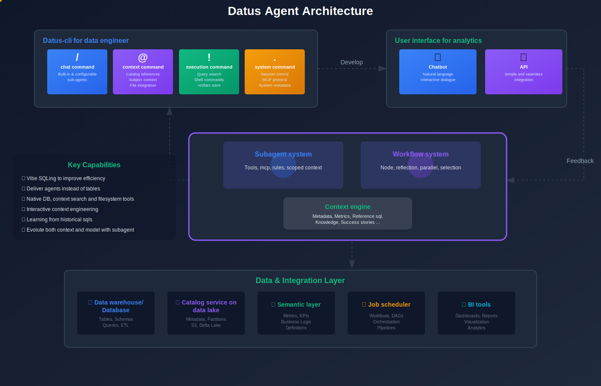

<table width="100%">
  <tr>
    <td align="left">
      <a href="https://www.apache.org/licenses/LICENSE-2.0">
        
      </a>
    </td>
    <td align="right">
      <a href="https://datus.ai"></a> 
    </td>
    <td align="right">
      <a href="https://docs.datus.ai/"></a> 
    </td>
    <td align="right">
      <a href="https://docs.datus.ai/getting_started/Quickstart/"></a> 
    </td>
    <td align="right">
      <a href="https://docs.datus.ai/release_notes/"></a> 
    </td>
    <td align="right">
      <a href="https://join.slack.com/t/datus-ai/shared_invite/zt-3g6h4fsdg-iOl5uNoz6A4GOc4xKKWUYg"></a>
    </td>
  </tr>
</table>

## 🎯 Overview

**Datus** is an open-source data engineering agent that builds evolvable context for your data system. 

Data engineering needs a shift from "building tables and pipelines" to "delivering scoped, domain-aware agents for analysts and business users. 



* Datus-CLI: An AI-powered command-line interface for data engineers—think "Claude Code for data engineers." Write SQL, build subagents, and construct context interactively.
* Datus-Chat: A web chatbot providing multi-turn conversations with built-in feedback mechanisms (upvotes, issue reports, success stories) for data analysts.
* Datus-API: APIs for other agents or applications that need stable, accurate data services.
* Semantic model–aware orchestration: preload MetricFlow-compatible YAML from ClickZetta volumes or local files and switch between semantic context and live schema linking per task.

## 🚀 Key Features

### 🧩 Contextual Data Engineering  
Automatically builds a **living semantic map** of your company’s data — combining metadata, metrics, SQL history, and external knowledge — so engineers and analysts collaborate through context instead of raw SQL.

### 💬 Agentic Chat  
A **Claude-Code-like CLI** for data engineers.  
Chat with your data, recall tables or metrics instantly, and run agentic actions — all in one terminal.

### 🧠 Subagents for Every Domain  
Turn data domains into **domain-aware chatbots**.  
Each subagent encapsulates the right context, tools, and rules — making data access accurate, reusable, and safe.

### 🔁 Continuous Learning Loop  
Every query and feedback improves the model.  
Datus learns from success stories and user corrections to evolve reasoning accuracy over time.

## 🛠️ Developer Quickstart

Set up a local environment that uses Dashscope for LLM calls and Clickzetta as the data source:

1. **Clone and install dependencies**
   ```bash
   git clone https://github.com/<your-org>/Datus-agent-clickzetta.git
   cd Datus-agent-clickzetta
   python3.11 -m venv .venv
   source .venv/bin/activate  # Windows: .venv\Scripts\activate
   pip install -r requirements.txt
   ```

2. **Create a `.env` file** at the project root to store secrets:
   ```bash
   DASHSCOPE_API_KEY=your_dashscope_key
   DEEPSEEK_API_KEY=your_deepseek_key
   CLICKZETTA_SERVICE=your_clickzetta_service
   CLICKZETTA_USERNAME=your_clickzetta_username
   CLICKZETTA_PASSWORD=your_clickzetta_password
   CLICKZETTA_INSTANCE=your_clickzetta_instance
   CLICKZETTA_WORKSPACE=your_clickzetta_workspace
   CLICKZETTA_SCHEMA=your_clickzetta_schema
   CLICKZETTA_VCLUSTER=your_clickzetta_vcluster
   ```
   The entry points (`datus-cli`, `python -m datus.main`, `datus/api/server.py`) automatically load this file via `python-dotenv`, so no manual export is required. For shell-based workflows you can still run `export $(grep -v '^#' .env | xargs)` before launching the CLI.

3. **Copy the Clickzetta configuration**
   ```bash
   cp conf/agent.clickzetta.yml.example conf/agent.clickzetta.yml
   ```
   The example file ships with Dashscope/DeepSeek models, a `clickzetta` namespace, and a `semantic_models` block. Update that block to point at your preferred ClickZetta volume/directory (or disable `allow_local_path` if needed) so the agent knows where to pull YAML specs.

4. **Start the CLI (or API)**
   ```bash
   mkdir -p .datus_home
   DATUS_HOME=$(pwd)/.datus_home python -m datus.cli.main --config conf/agent.clickzetta.yml --namespace clickzetta
   # optionally launch the API server
   DATUS_HOME=$(pwd)/.datus_home python -m datus.api.server --config conf/agent.clickzetta.yml --namespace clickzetta
   ```
   During `!dastart` you can now choose whether the workflow should load a semantic model (from the volume or a local file) or fall back to schema linking. Pick `semantic_model` for strict semantic prompting, `auto` for best-effort loading, or `schema_linking` if you only want live metadata.

5. **(Optional) Preload a semantic model for the run**
   ```bash
   !lsm --dir semantic_models
   !dastart
   # Context source [auto|schema_linking|semantic_model]: semantic_model
   # Semantic model volume/stage: volume:user://~/
   # Semantic model directory (optional): semantic_models
   # Semantic model filename (.yaml/.yml): retail_finance.yaml
   ```
   After choosing an index the semantic model is loaded for chat/SQL generation. The `load_semantic_model` node fetches the YAML before schema linking starts, injects measures/dimensions into the SQL prompt, and only falls back to raw metadata if you select `auto`.


---

## 📚 Semantic Model Workflow

1. **Configure defaults** – in any agent config file include:
   ```yaml
   semantic_models:
     default_strategy: auto          # auto | schema_linking | semantic_model
     default_volume: volume:user://~/  # base ClickZetta user volume
     default_directory: semantic_models  # folder within the user volume
     allow_local_path: true          # set false to forbid direct filesystem reads
     prompt_max_length: 14000        # truncate long YAML snippets before prompting
   ```
2. **Store YAML assets** – upload either MetricFlow-style (`semantic_models:`) or Analyst-spec (`tables:`, `relationships:`, `verified_queries:`) semantic model files to your ClickZetta user volume (the default volume is `volume:user://~/` with `semantic_models/` as the directory, so subfolders like `finance/` work naturally) or keep them on disk when `allow_local_path` is enabled. Use `!list_semantic_models` (alias `!lsm`) to browse and select the YAML you want to load for the current session.
3. **Pick the context source per task** – the CLI (and API) honour `semantic_model`, `schema_linking`, or `auto` selection, giving you deterministic prompts when a curated semantic spec is available.
4. **Enjoy richer prompts** – the SQL generator now includes a “Semantic Model Specification” section with logical tables, base table FQNs, dimensions, facts, table-level metrics, relationships, model metrics, and verified queries pulled directly from the YAML spec, reducing guesswork and improving query accuracy.
5. **Automatic fallback** – when the chosen semantic model cannot be read and the strategy is `auto`, the workflow transparently falls back to schema linking; if you picked `semantic_model`, the run stops early with a clear error so you can fix the path or permissions.

---

## 🧰 Installation

**Requirements:** Python >= 3.9 and Python <= 3.11, 3.11 is verified.

```bash
pip install datus-agent-clickzetta==0.2.1

datus-agent-clickzetta init  # 或使用 datus-agent init 兼容命令
```

For detailed installation instructions, see the [Quickstart Guide](https://docs.datus.ai/getting_started/Quickstart/).

## 🧭 User Journey

### 1️⃣ Initial Exploration

A Data Engineer (DE) starts by chatting with the database using /chat.
They run simple questions, test joins, and refine prompts using @table or @file.
Each round of feedback (e.g., "Join table1 and table2 by PK") helps the model improve accuracy.
`datus-cli --namespace demo`
`/Check the top 10 bank by assets lost @Table duckdb-demo.main.bank_failures`

Learn more: [CLI Introduction](https://docs.datus.ai/cli/introduction/)

### 2️⃣ Building Context

The DE imports SQL history and semantic model YAMLs generated from the external toolchain (see `semantic-model-generator`).
Using `@subject` they inspect or refine metrics, and `/chat` immediately benefits from the combined SQL history + semantic context.

Learn more: [Knowledge Base Introduction](https://docs.datus.ai/knowledge_base/introduction/)

### 3️⃣ Creating a Subagent

When the context matures, the DE defines a domain-specific chatbot (Subagent):

`.subagent add mychatbot`

They describe its purpose, add rules, choose tools, and limit scope (e.g., 5 tables).
Each subagent becomes a reusable, scoped assistant for a specific business area.

Learn more: [Subagent Introduction](https://docs.datus.ai/subagent/introduction/)

### 4️⃣ Delivering to Analysts

The Subagent is deployed to a web interface:
`http://localhost:8501/?subagent=mychatbot`

Analysts chat directly, upvote correct answers, or report issues for feedback.
Results can be saved via !export.

Learn more: [Web Chatbot Introduction](https://docs.datus.ai/web_chatbot/introduction/)

### 5️⃣ Refinement & Iteration

Feedback from analysts loops back to improve the subagent:
engineers fix SQL, add rules, and update context.
Over time, the chatbot becomes more accurate, self-evolving, and domain-aware.

For detailed guidance, please follow our [tutorial](https://docs.datus.ai/getting_started/contextual_data_engineering/).
